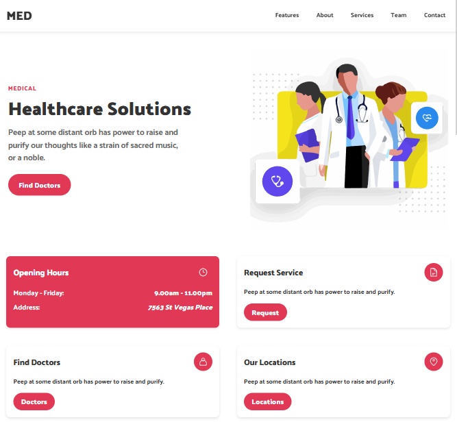

# 🏥 Medical - Healthcare Template

<p align="center">
  
</p>

<p align="center">
   <a href="https://HamzehEsmaeili.github.io/medical-template/">
    <strong>✨ Explore More in Live Demo → </strong>
  </a>
</p>

## 🩺 Introduction

A modern, responsive healthcare website template built with **pure HTML, CSS, and JavaScript**. Perfect for clinics, hospitals, and medical centers seeking a professional, accessible, and easy-to-customize online presence.

Clean, semantic code with full accessibility support and mobile-first design.

## ✨ Key Features

- 📱 **Fully Responsive** — Flawless on mobile, tablet, and desktop
- 🔍 **Accessibility-First** — `aria-*`, `alt`, skip-link, semantic HTML, keyboard navigation
- 🎨 **Clean & Modern Design** — Professional medical aesthetic with smooth animations
- ⚙️ **Pure HTML, CSS, JS** - (easy to modify and extend)
- 📅 **Interactive Sections** — Services, team, appointment scheduling, testimonials
- ✅ **Form Validation** — Contact form with visual feedback (client-side only)
- 🚫 **No Horizontal Scroll** — Pixel-perfect layout across all devices
- 📦 **Well-Structured** — Organized folders and clean CSS variables

## 🛠 Technologies Used

- 
- 
- 
- 
- 

## 🌐 Live Demo

[](https://HamzehEsmaeili.github.io/medical-template/)  
🔗 **URL**: [https://HamzehEsmaeili.github.io/medical-template/](https://HamzehEsmaeili.github.io/medical-template/)

## 💻 How to Run

1. Clone the repository:

```bash
git clone https://github.com/HamzehEsmaeili/medical-template.git
```

2. Navigate into the folder:

```
cd medical-template
```

3. Open index.html in your browser, or use a live server (e.g., VS Code Live Server).

## 📂 Project Structure

```
medical-template/
├── assets/
│   ├── css/
│   │   ├── style.css       # Main styles & variables
│   │   └── query.css       # Media queries
│   ├── js/
│   │   └── main.js         # Mobile menu & interactions
├── images/
│   └── icons/
├── index.html
└── README.md
```

## 🧩 Interactive Features

- Mobile-Friendly Navigation — Hamburger menu with ARIA controls
- Service Selector — Click to highlight medical services (dental, cardiology, etc.)

- Hover Effects — Cards, buttons, and team members animate smoothly

- Scroll-to-Top Button — Appears on scroll for better UX

- Form Feedback — Visual validation and success message

## 🎨 Customization Tips

- Change Colors: Edit CSS variables in :root (e.g. `--color-primary: #e13856;`)

- Update Content: Replace text and image paths in index.html

- Add Doctors: Duplicate .team\_\_box elements with new images and info

- Fonts: Swap Google Fonts in <head> and update --font-family

## 📜 License

This project is open-source and available under the MIT License. Feel free to use, modify, and distribute with attribution.
